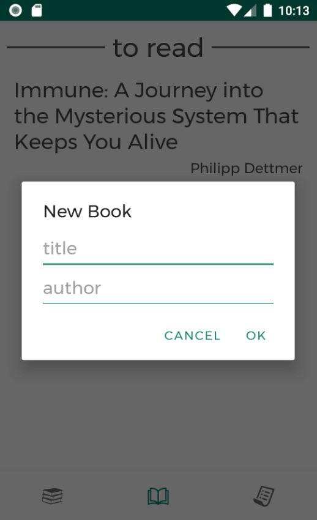

# Flyleaf

 

Flyleaf is an app for bookworms, who want to carry a list of their books with them on their phone (like an inventory), sorted in different categories.

Additionally, it allows you to maintain a list of books you are about to read and save the ones you are planning to buy.

My books | To Read | To Buy |
:-------------------------:|:-------------------------:|:-------------------------:|
 |  |  |

## Download & Installation

You can download the APK at the top-level of this repository [flyleaf.apk](https://github.com/lchristmann/android-flyleaf/blob/main/flyleaf.apk).

Install it by clicking on the downloaded file and following the instructions of your phone or go along some tutorial on the internet. It will warn you that APKs from an unknown source are dangerous - and they may be. So if you have doubts either (1) [contact](https://lchristmann.com/contact/) and [get to know me](https://lchristmann.com) or (2) download the whole source code provided here, review it and build the APK yourself with [Android Studio](https://developer.android.com/studio).

## Background story

You can read about how I got to develop this and two more Android applications on my personal website at [lchristmann.com/projects/app-development](https://lchristmann.com/projects/app-development/).